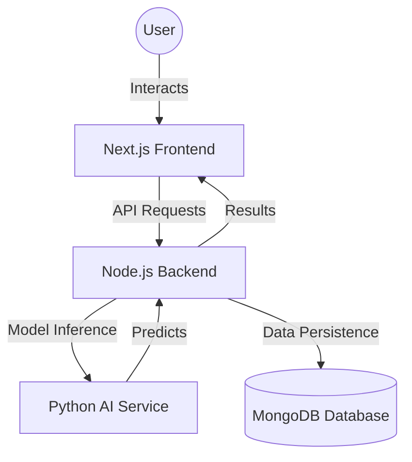

# PlantCare AI - Production-Ready Plant Disease Detection

PlantCare AI is a comprehensive SaaS platform built for farmers, researchers, and students to detect and manage plant diseases using advanced Deep Learning (**MobileNetV2 Transfer Learning**).

## 🚀 Key Features

*   **AI Disease Scanner**: Real-time identification of 38+ plant diseases and species.
*   **Disease Intelligence**: Detailed diagnosis including causes, treatments, and prevention tips.
*   **Premium Dashboard**: Glassmorphism UI with interactive Chart.js analytics.
*   **History & Reports**: Track scan history with confidence metrics and export capabilities.
*   **Multi-Service Architecture**: Scalable Docker-orchestrated system (Next.js, Node.js, Python/TensorFlow).

## 🏗️ System Architecture



## 🛠️ Tech Stack

*   **Frontend**: Next.js 14, React.js, Tailwind CSS, Framer Motion, Chart.js.
*   **Backend**: Node.js, Express.js (Auth & Business Logic).
*   **AI Engine**: Python, Flask, TensorFlow, MobileNetV2.
*   **Database**: MongoDB (Mongoose).
*   **Infrastructure**: Docker, Docker Compose.

## 📦 Project Structure

```text
PlantCare/
├── frontend/           # Next.js 14 Dashboard
├── backend/            # Node.js Express API
├── ai_service/         # Python Flask AI API (Microservice)
├── database/           # [NEW] Data Models & Schema Docs
├── docker-compose.yml  # System Orchestration
└── README.md           # This file
```

## 🛠️ Installation & Setup (Sabse Aasaan Tarika)

### ⚡ One-Click Launch (Windows) - RECOMMENDED
Maine aapke liye ek auto-launcher banaya hai jo saara setup khud kar lega.
1.  **Project Folder Kholein**: `C:\Users\HP\Desktop\PlantCare`.
2.  **Double-Click `run.bat`**: Is file par double-click karein. 
3.  **Done!**: Ye script ports saaf karegi, dependencies install karegi, aur Frontend/Backend dono ko start kar degi.

### 💻 Manual Run (Terminal)
Agar aap manually run karna chahte hain:
1.  **Dependencies Install Karein**: 
    ```bash
    npm run install:all
    ```
2.  **Ports Saaf Karein**:
    ```bash
    npm run fix-ports
    ```
3.  **Site Start Karein**:
    ```bash
    npm run dev
    ```

## 🔒 Access & Ports
-   **Frontend Dashboard**: [http://localhost:3000](http://localhost:3000)
-   **Backend API**: [http://localhost:8000](http://localhost:8000)
-   **AI Service**: [http://localhost:5000](http://localhost:5000)
-   **Database URI**: `mongodb://localhost:27017`

## 📄 Documentation
-   [Backend Docs](file:///c:/Users/HP/Desktop/PlantCare/backend/README.md) (If exists)
-   [Database & Schema Docs](file:///c:/Users/HP/Desktop/PlantCare/database/README.md)
-   [Frontend Setup](file:///c:/Users/HP/Desktop/PlantCare/frontend/README.md) (If exists)

## 📄 License
MIT License. Created by Senior AI Architects & Full Stack Team.
