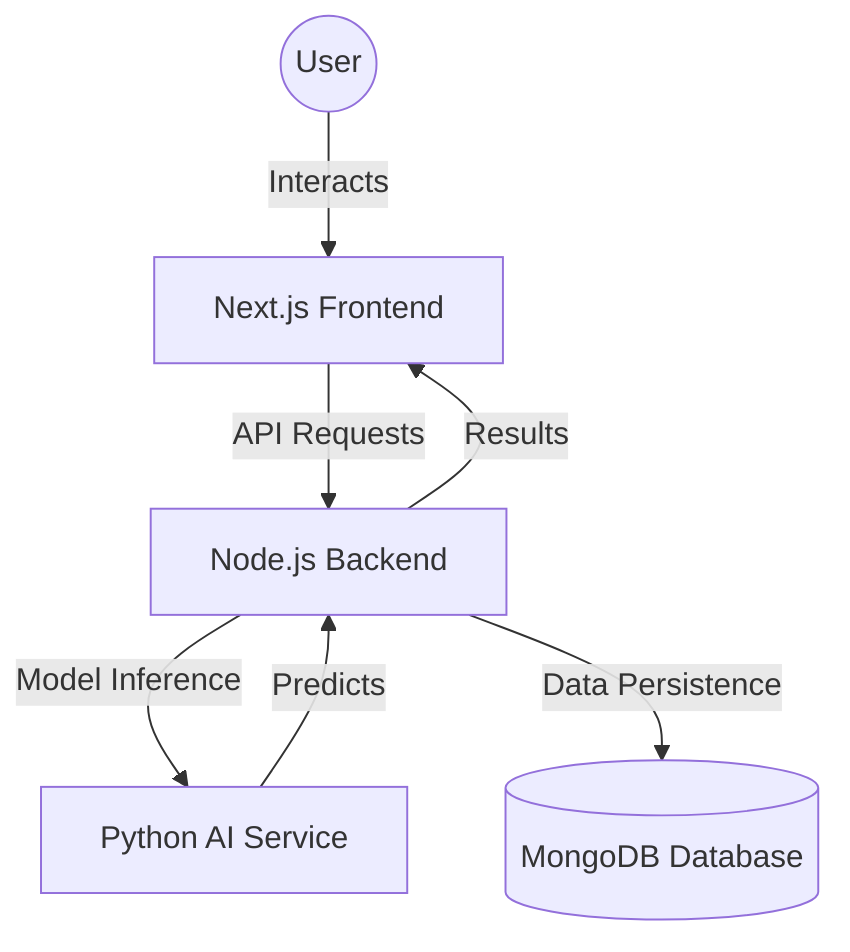

# PlantCare AI - Production-Ready Plant Disease Detection

PlantCare AI is a comprehensive platform designed for farmers, researchers, and students to detect and manage plant diseases using advanced Deep Learning (**MobileNetV2 Transfer Learning**).

## 🚀 Key Features

*   **AI Disease Scanner**: Real-time identification of 38+ plant diseases and species.
*   **Disease Intelligence**: Detailed diagnosis including causes, treatments, and prevention tips.
*   **Premium Dashboard**: Glassmorphism UI with interactive Chart.js analytics.
*   **History & Reports**: Track scan history with confidence metrics and export capabilities.
*   **Multi-Service Architecture**: Scalable Docker-orchestrated system (Next.js, Node.js, Python/TensorFlow).
## 🏗️ System Architecture

## 🛠️ Tech Stack

*   **Frontend**: Next.js 14, React.js, Tailwind CSS, Framer Motion, Chart.js
*   **Backend**: Node.js, Express.js, Mongoose ODM
*   **AI Service**: Python, TensorFlow, Keras, Flask
*   **Database**: MongoDB
*   **DevOps**: Docker, Docker Compose
